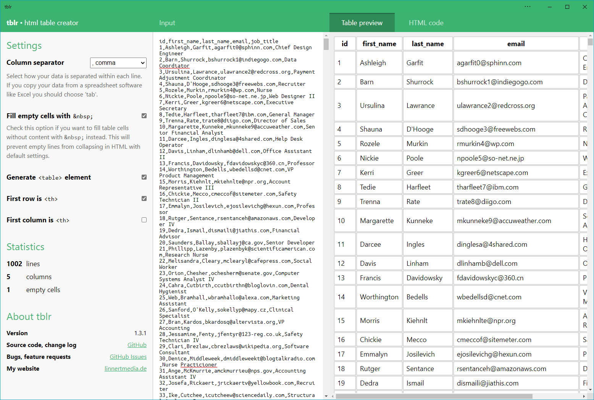
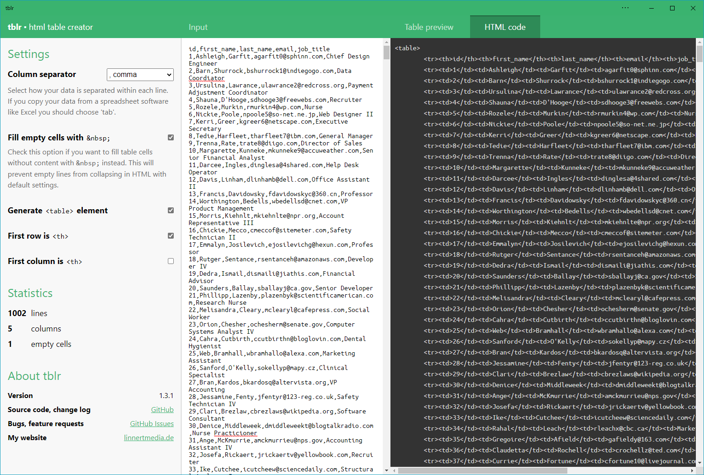

#  tblr - html table creator for the web

→ **[Launch Tblr](https://alinnert.github.io/tblr/)**

## Description
This app converts your data ‒ copy-pasted from Excel, a CSV or other text-based formats ‒ into an html table.

You can also see some statistics about your data like number of rows, columns and empty cells.

## Screenshots
### Preview data in a table

### Generate HTML

*Data in the screenshots is from [Mockaroo](https://mockaroo.com/).*

## Known issues
### No support for line breaks
It's not supported to paste tables from _Microsoft Office Excel_ that include line breaks.

*Why?* ‒ There's technically no difference between line breaks and a new table row. There's no way to tell them apart.

## Links
* [Chrome OS App](https://chrome.google.com/webstore/detail/tblr/hfpbmgjmknhcakmgmfofmjloiecbocjj) (**deprecated!**)
