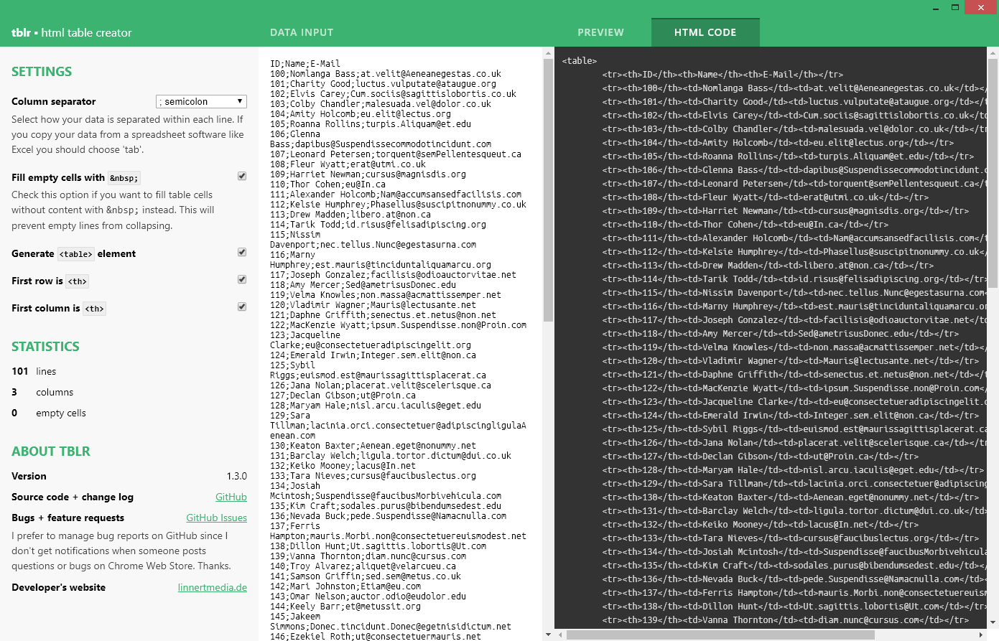

#  tblr - html table creator for Chrome OS

## Description

This app converts your data into a html table.

You can copy data from Excel or a simlar software into this app and it generates the html code for a table with the provided data.

It's possible to change the delimiter within each line. This allows you to generate tables of CSV for instance.

You can also see some statistics about your data like:

* number of rows
* number of columns
* number of empty cells (cells without any data)

## Status

I have plans to convert this into a regular web application (possibly a PWA). But I'm working on other projects right now.

## Screenshots

## Known issues

### No support for line breaks

It's not supported to paste tables from _Microsoft Office Excel_ that include line breaks.

Why? There's technically no difference between line breaks and a new table row.

### Packaged Apps on non-Chrome OS devices

Google dropped support for Packaged Apps on non-Chrome OS devices. Therefore, it's already on my radar to port this app to a PWA.

## Links

* [App in Chrome Web Store](https://chrome.google.com/webstore/detail/tblr/hfpbmgjmknhcakmgmfofmjloiecbocjj)
* [Change log](https://github.com/alinnert/tblr-chrome-app/blob/master/CHANGELOG.md)
