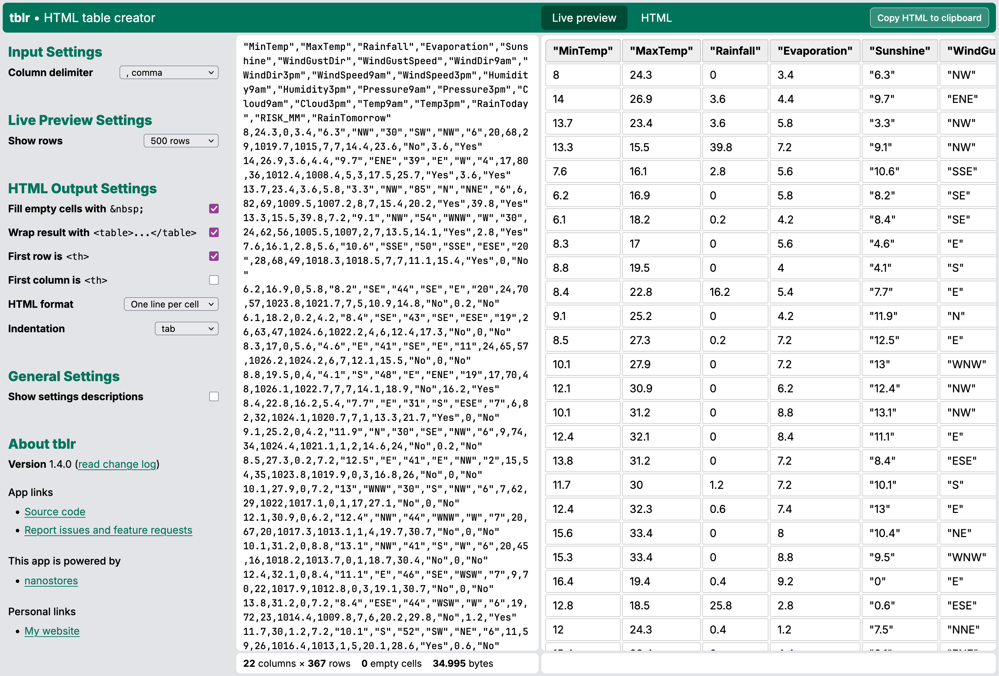
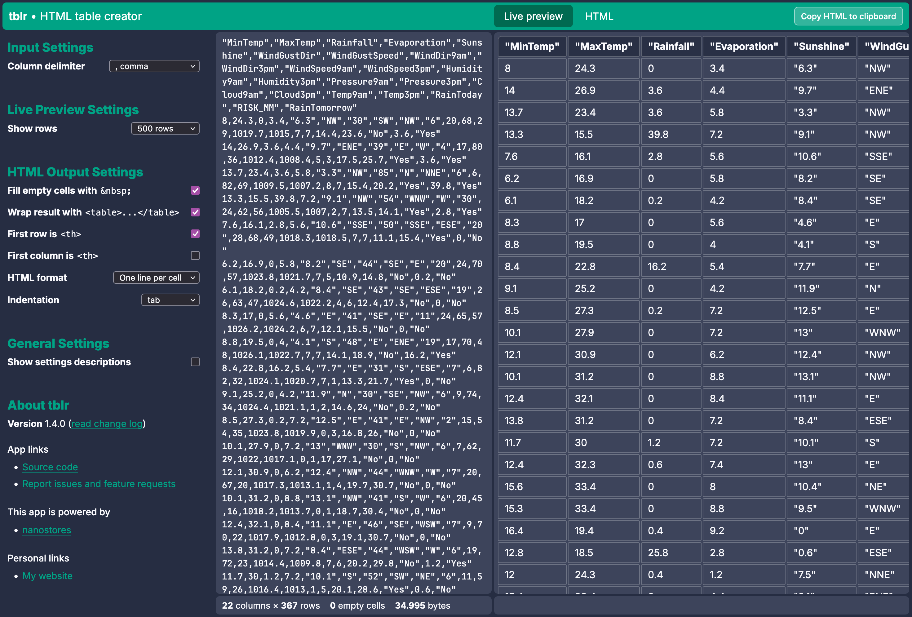
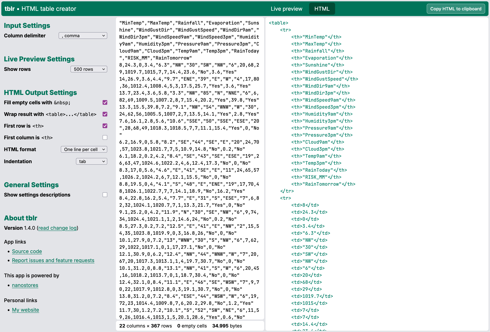

# tblr - HTML table creator for the web

→ **[Launch Tblr](https://alinnert.github.io/tblr/)**

## Description

This app converts your data ‒ copy-pasted from Excel, a CSV or other text-based formats ‒ into an HTML table. You can also see some stats about your data like number of rows, columns and empty cells.

## Screenshots

### Preview data

### Generate HTML

## Known issues

### No support for line breaks in spreadsheet cells

You can paste data from spreadsheet software like _Microsoft Office Excel_ that include line breaks but they will be interpreted like new table rows.

**Why?**

There's technically no difference between line breaks and a new table row. There's no way to tell them apart.

### Quotes are printed as is

Real CSV data that enclose individual cells with quotes aren't supported yet. That means if a table cell contains a delimiter inside a cell that's enclosed with quotes it still gets interpreted as a column delimiter even though it shouldn't.

**Why?**

I need to implement a more advanced parser first. That can take some time.
